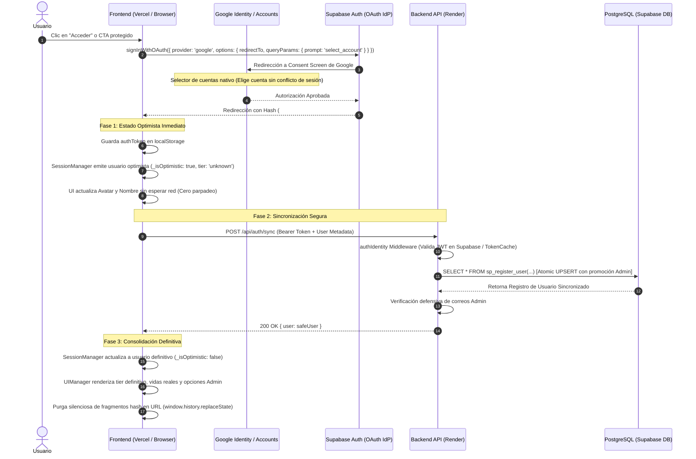
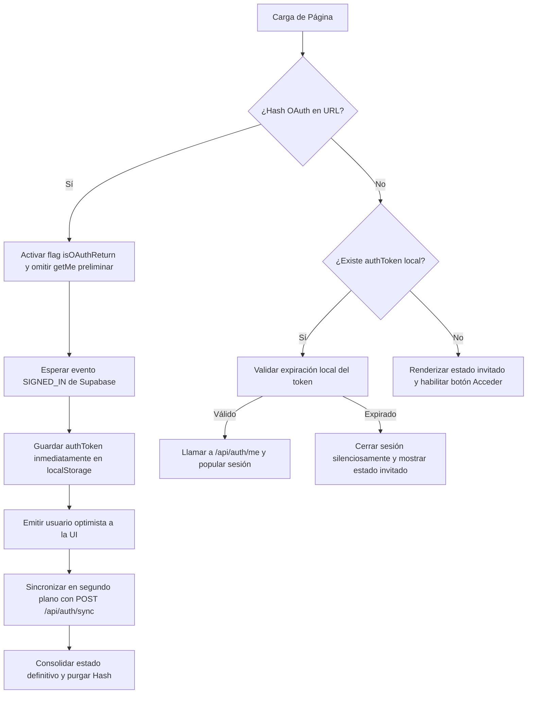

# Arquitectura y Estándares del Sistema de Autenticación (Hub Academia)

Este documento detalla la arquitectura técnica integral, el flujo de vida de la sesión, los mecanismos de seguridad, la persistencia en base de datos, el renderizado optimista y la convivencia de los métodos de acceso implementados en el sistema de autenticación de **Hub Academia** y sus aplicaciones ecosistémicas (**HubDocenteApp** y **HubSaludApp**).

---

## 1. Visión General de la Arquitectura

Hub Academia implementa una arquitectura de autenticación estandarizada basada en **Google OAuth 2.0 Direct Flow** con selector explícito de cuentas (`prompt: 'select_account'`), respaldada por **Supabase Auth** como proveedor de identidad (*Identity Provider - IdP*) y **PostgreSQL** como base de datos transaccional del dominio de negocio.

Toda la plataforma web y los entornos educativos utilizan un flujo de autenticación unificado, robusto y multiplataforma:
* **Google OAuth Direct Flow (`signInWithOAuth`):** Disparado explícitamente desde botones de acción ("Acceder" en el header, modales de protección de contenido y banners interactivos).



---

## 2. Métodos de Acceso: Flujo Directo y Google One Tap Resiliente (FedCM)

### 2.1. Diagnóstico Técnico de FedCM y Resolución de Error 400 (`invalid_user`)
En versiones modernas de Chromium (Google Chrome 120 a 145+), Google forzó la API **FedCM (Federated Credential Management)** en modo pasivo (`mode=passive`) para los flujos de Google One Tap.

**Causa Raíz de los Fallos Anteriores en Google Chrome:**
1. **Conflicto Multi-Cuenta (`Error 400: invalid_user`):** Chrome mantiene un registro interno de identidades (`login_hint`). Si el usuario tiene múltiples cuentas de Google abiertas o su cookie de sesión cambió de índice, la API FedCM emite:
   > `FedCM request failed to identify a unique session`
2. **Ventanas Emergentes Bloqueantes por `itp_support: true`:** La implementación anterior utilizaba `itp_support: true` o intentaba forzar `ux_mode: 'popup'`. Ante la falla de aserción pasiva, la librería externa de Google intentaba recuperarse abriendo automáticamente un popup a `accounts.google.com/signin/oauth/error`, mostrando la pantalla negra de *"Acceso bloqueado: error de autorización (Error 400: invalid_user)"*, interrumpiendo la navegación.

**Solución Arquitectónica: `GoogleOneTapService` (`googleOneTapService.js`):**
Para restituir el acceso rápido sin riesgos de error o bloqueo, se diseñó un servicio modular, aislado y testeado con cobertura unitaria completa:
* **Configuración Blindada:** Se elimina estrictamente `itp_support: true` y no se fuerza `ux_mode: 'popup'` en `initialize()`. La inicialización utiliza configuración mínima y limpia:
  ```javascript
  google.accounts.id.initialize({
      client_id: clientId,
      callback: (res) => this.handleCredential(res),
      auto_select: false,
      cancel_on_tap_outside: true,
      context: 'signin'
  });
  ```
* **Degradación Silenciosa con `momentListener`:** El prompt se invoca capturando el estado de la notificación:
  ```javascript
  google.accounts.id.prompt((notification) => {
      if (notification.isNotDisplayed()) {
          console.log('ℹ️ [GoogleOneTapService] Prompt no mostrado:', notification.getNotDisplayedReason?.());
      } else if (notification.isSkippedMoment()) {
          console.log('ℹ️ [GoogleOneTapService] Prompt omitido:', notification.getSkippedReason?.());
      } else if (notification.isDismissedMoment()) {
          console.log('ℹ️ [GoogleOneTapService] Prompt cerrado por el usuario.');
      }
  });
  ```
  Si FedCM no puede resolver la identidad unívoca de forma pasiva, **degrada en completo silencio**, sin lanzar excepciones ni abrir popups molestos.
* **Condiciones de Guarda (`canPrompt()`):** Se evalúa preventivamente:
  * Si el usuario ya cuenta con sesión activa (`localStorage.getItem('authToken')` o `sessionManager.isLoggedIn()`), el prompt no se muestra.
  * Si existe una navegación OAuth en curso (`_isAuthenticating` o fragmentos hash `#access_token=...`), se omite.
* **Integración Nativa con Supabase (`handleCredential`):**
  Al recibir el ID Token (JWT) desde One Tap, se envía directamente a Supabase:
  ```javascript
  const { data, error } = await client.auth.signInWithIdToken({
      provider: 'google',
      token: response.credential
  });
  ```
  Esto dispara de inmediato el evento `SIGNED_IN` en `SessionManager`, activando el pipeline habitual de renderizado optimista, sincronización con backend y consolidación en PostgreSQL.
* **Cancelación Reactiva (`cancel()`):** Si el usuario inicia sesión mediante cualquier otro botón o CTA, el observer de `SessionManager` invoca automáticamente `GoogleOneTapService.cancel()`.

### 2.2. Flujo Directo Google OAuth (`app.js` / `window.triggerGoogleLogin`)
Es el canal explícito principal, activado manualmente por el usuario ("Acceder" en el header, modales de protección de contenido y botones de simulacros).
* **Invocación Centralizada:** Accesible globalmente mediante `window.triggerGoogleLogin(buttonElement)`.
* **Cumplimiento RFC 6749 (Sin fragmentos hash en Redirect URI):**
  ```javascript
  const cleanRedirectUrl = window.location.origin + window.location.pathname;
  const { data, error } = await client.auth.signInWithOAuth({
      provider: 'google',
      options: { 
          redirectTo: cleanRedirectUrl,
          queryParams: { prompt: 'select_account' } // Permite elegir entre múltiples cuentas sin ambigüedad
      }
  });
  if (data?.url) {
      window.location.href = data.url; // Navegación explícita y segura
  }
  ```
* **Retorno OAuth sin Falso 401:** Al retornar de Google con fragmento hash (`#access_token=...`), `SessionManager.initialize()` detecta `isOAuthReturn` y omite llamadas preliminares con tokens viejos, esperando a que Supabase emita `SIGNED_IN`.

### 2.3. Estado y Compatibilidad en Aplicaciones Móviles (HubDocenteApp y HubSaludApp)
* **Aislamiento de Entorno:** Las aplicaciones móviles del ecosistema están construidas en React Native (Expo) y gestionan la autenticación mediante el módulo nativo `WebBrowser.openAuthSessionAsync` acoplado a deep linking (`Linking.createURL`).
* **Inmunidad a FedCM:** La biblioteca DOM `accounts.google.com/gsi/client` y el protocolo FedCM son APIs del navegador web. Las aplicaciones móviles se conectan directamente vía browser modal nativo del sistema operativo (Custom Tabs en Android / ASWebAuthenticationSession en iOS), por lo que **no requieren modificaciones ni están expuestas a los conflictos de FedCM/One Tap del navegador web**.

---

## 3. Componentes y Responsabilidades

### 3.1. Capa Frontend (Presentación)

#### `SessionManager` (`sessionManager.js`)
* **Única Fuente de Verdad:** Controla el estado global de la sesión en el navegador (`currentUser`).
* **Patrón Observer con Invocación Inmediata:**
  ```javascript
  onStateChange(callback) {
      if (typeof callback === 'function') {
          this.listeners.push(callback);
          // Si ya existe un usuario en memoria, se ejecuta de inmediato para evitar
          // condiciones de carrera por orden de carga asíncrona de scripts
          if (this.currentUser) {
              try {
                  callback(this.currentUser);
              } catch (e) {
                  console.error('Error en listener inmediato de sesión:', e);
              }
          }
      }
  }
  ```
* **Renderizado Optimista:**
  * Al capturar `SIGNED_IN` o `INITIAL_SESSION`, guarda inmediatamente el token fresco en `localStorage.setItem('authToken', session.access_token)`.
  * Emite un usuario provisional con `_isOptimistic: true`, `subscriptionTier: 'unknown'` y `subscriptionStatus: 'pending'`.
  * Si el correo pertenece a la lista de administradores, asigna preventivamente `role: 'admin'`.
  * Esto permite que la interfaz muestre el nombre y avatar del usuario al instante (< 10 ms), sin pantallas en blanco ni bloqueos de interfaz.
* **Consolidación Definitiva:**
  * Ejecuta en segundo plano `syncGoogleUser` con el backend.
  * Al recibir la respuesta de `/api/auth/sync`, consolida los datos reales (`tier`, `vidas`, `role`) y emite una segunda actualización con `_isOptimistic: false`.
* **Saneamiento de URL:**
  * Al completarse la sesión, purga el hash de la barra de direcciones mediante `window.history.replaceState(null, '', cleanUrl)`.
* **Limpieza Segura (*Nuclear Logout*):**
  * Limpia de forma síncrona `localStorage`, `sessionStorage`, cachés locales y ejecuta `supabaseClient.auth.signOut()`.

#### `UIManager` (`uiManager.js`)
* **Supresión de Parpadeo en Barra de Vidas:**
  ```javascript
  updateFreemiumStatus(user) {
      // Evita renderizar la barra de vidas si el usuario aún está en estado optimista
      // impidiendo que los usuarios Basic/Advanced vean la barra por una fracción de segundo
      if (!user || user._isOptimistic || user.subscriptionTier === 'unknown') {
          return;
      }
      // Renderizado de vidas solo para usuarios confirmados de tier 'free'
      ...
  }
  ```
* **Supresión de Modal de Renovación Semanal:**
  * `checkAndShowWelcomeModal()` bloquea el modal de "10 vidas semanales" si:
    1. El usuario está en estado optimista (`_isOptimistic`).
    2. El usuario pertenece a un plan de pago (`basic` o `advanced`).
    3. La página actual es un entorno de evaluación (`quiz.html` o `simulator-dashboard.html`).
* **Soporte de Rol Administrador en Header:**
  * Si `user.role === 'admin'`, se inyecta dinámicamente la opción **"Panel de Gestión"** (`/admin.html`) en el menú desplegable del usuario.
  * El distintivo del plan muestra la etiqueta dorada **"Administrador"** con clase `.tier-admin` (`#f59e0b`).

#### `NetworkService` (`networkService.js`) y `AuthApiService` (`authApiService.js`)
* **Gateway Centralizado:** Inyecta automáticamente el token Bearer actualizado desde `AuthApiService.getValidToken()`.
* **Protección contra 401 en Tránsito:** Si la aplicación se encuentra en medio de un flujo de login (`_isAuthenticating` o retorno OAuth), los errores 401 no disparan `logout()` prematuro ni redirecciones involuntarias.
* **Validación Local de JWT:** `isTokenExpired(token)` decodifica el payload en base64 y evalúa `exp` con 60 segundos de holgura preventiva sin consumo de red.

---

### 3.2. Capa Backend (Infraestructura y Dominio)

#### `authMiddleware.js`
* **`authIdentity`:** Diseñado exclusivamente para `/api/auth/sync`. Valida la firma y vigencia del JWT con Supabase sin exigir la existencia previa del usuario en la tabla `users` de PostgreSQL.
* **`auth`:** Autenticación completa para rutas protegidas. Valida el token con Supabase, consulta la base de datos local y construye `req.user` con roles, vidas, tier y límites.
* **Caché en Memoria (`tokenCache`):** Almacena en memoria las validaciones exitosas de tokens durante 3 minutos (con limpieza automática por TTL) para reducir drásticamente la latencia y evitar la saturación de la API de Supabase.
* **Resiliencia de Red (`getUserWithRetry`):** Aplica reintentos automáticos con retroceso exponencial (*Exponential Backoff*) ante errores transitorios de red o DNS (`AuthRetryableFetchError`).
* **`adminOnly`:** Restringe el acceso a endpoints de gestión validando estrictamente `req.user.role === 'admin'`.

#### `AuthService` (`authService.js`)
* **Orquestación de Sincronización:** Recibe los metadatos de Google (`id`, `name`, `email`, `avatar_url`) y delega el registro al repositorio.
* **Promoción Defensiva de Administradores:**
  Tanto en `syncGoogleUser` como en `getUserWithStatus`, el servicio contrasta el correo contra la lista blanca configurada (`ADMIN_EMAILS`):
  ```javascript
  const adminEmails = (process.env.ADMIN_EMAILS || 'hubacademia01@gmail.com')
      .split(',')
      .map(e => e.trim().toLowerCase());
  
  if (adminEmails.includes(user.email.toLowerCase()) && user.role !== 'admin') {
      await this.userRepository.update(user.id, { role: 'admin' });
      user.role = 'admin';
  }
  ```
* **Renovación Semanal de Vidas:** Delega a `UsageService.renewWeeklyLivesIfNeeded()` el restablecimiento de vidas para usuarios del plan `free`.

#### `UserRepository` (`userRepository.js`)
* Invoca la función almacenada `sp_register_user`.
* Incluye mecanismo de respaldo (*fallback*) directo con cláusula `ON CONFLICT (email) DO UPDATE SET role = CASE WHEN EXCLUDED.role = 'admin' THEN 'admin' ELSE users.role END`.

---

## 4. Persistencia en Base de Datos: `sp_register_user`

El registro y sincronización de usuarios se ejecuta mediante una función atómica en PostgreSQL (`src/infrastructure/database/sp_register_user.sql`):

```sql
CREATE OR REPLACE FUNCTION sp_register_user(
    p_id UUID,
    p_name TEXT,
    p_email TEXT,
    p_password_hash TEXT,
    p_role TEXT DEFAULT 'student',
    p_avatar_url TEXT DEFAULT NULL
)
RETURNS SETOF public.users AS $$
BEGIN
    -- UPSERT Atómico y Seguro:
    -- 1. Si el correo ya existe, sincroniza el ID de Supabase Auth, avatar, actualiza timestamp
    --    y promueve el rol a 'admin' si el nuevo rol es 'admin' sin degradar admins existentes.
    -- 2. Si es un usuario nuevo, inserta con tier 'free' y 10 vidas iniciales.
    RETURN QUERY
    INSERT INTO public.users (
        id, name, email, password_hash, role, avatar_url,
        subscription_status, subscription_tier, 
        usage_count, max_free_limit, last_usage_reset, 
        last_free_renewal, created_at, updated_at
    ) 
    VALUES (
        p_id, p_name, lower(p_email), p_password_hash, p_role, p_avatar_url,
        'pending', 'free', 0, 10, CURRENT_DATE, NOW(), NOW(), NOW()
    )
    ON CONFLICT (email) 
    DO UPDATE SET
        id = EXCLUDED.id, -- Sincronizar el ID de Supabase Auth
        name = EXCLUDED.name,
        role = CASE 
            WHEN EXCLUDED.role = 'admin' THEN 'admin'
            ELSE public.users.role
        END,
        avatar_url = COALESCE(EXCLUDED.avatar_url, public.users.avatar_url),
        updated_at = NOW()
    RETURNING *;
END;
$$ LANGUAGE plpgsql SECURITY DEFINER SET search_path = public;

-- Revocación de privilegios públicos (Solo backend con credenciales seguras de servicio)
REVOKE EXECUTE ON FUNCTION public.sp_register_user(uuid, text, text, text, text, text) FROM PUBLIC, anon, authenticated;
```

### Garantías de este diseño:
1. **Inmunidad a Colisiones (`23505 Immunity`):** `ON CONFLICT (email) DO UPDATE` garantiza cero errores de concurrencia al registrar usuarios simultáneos.
2. **Preservación y Elevación de Privilegios:** La cláusula condicional `CASE WHEN EXCLUDED.role = 'admin' THEN 'admin' ELSE public.users.role END` asegura que una cuenta designada como administradora nunca quede degradada a `student` tras un re-login, elevando automáticamente su privilegio en base de datos.
3. **Seguridad de Esquema (`search_path`):** La directiva explícita `SET search_path = public` mitiga vulnerabilidades de inyección por suplantación de esquemas (aprobada por el Supabase Security Linter).
4. **Acceso Restringido:** Ejecución revocada para roles anónimos y autenticados (`REVOKE EXECUTE FROM anon, authenticated`).

---

## 5. Estándares de Rendimiento y Latencia

| Operación | Mecanismo | Latencia Típica |
| :--- | :--- | :---: |
| Emisión de Estado Optimista | Local en memoria (`SessionManager`) | **< 5 ms** |
| Persistencia Anticipada de Token | Síncrona en `localStorage` | **< 1 ms** |
| Validación de Expiración JWT | Local en cliente (`isTokenExpired`) | **< 1 ms** |
| Verificación en Caché de Backend | `tokenCache.get(token)` | **< 2 ms** |
| Sincronización DB (`sp_register_user`) | PostgreSQL UPSERT en Pooler Transaccional | **~80 - 150 ms** |
| Consulta de Usuario (`findById`) | Búsqueda por PK indexada | **~30 - 60 ms** |
| **Tiempo Total a UI Interactiva** | Renderizado Optimista Inicial | **< 20 ms** |
| **Tiempo de Consolidación Final** | Flujo completo Frontend ↔ Backend ↔ DB | **~250 - 350 ms** |

---

## 6. Prevención de Condiciones de Carrera (Race Conditions)



1. **Invocación Inmediata de Observadores:** Al invocar `sessionManager.onStateChange(cb)`, si el usuario ya está cargado en memoria, el callback se dispara en ese mismo instante. Esto neutraliza de raíz cualquier desfase cuando `app.js` u otros módulos se cargan asíncronamente después del evento de Supabase.
2. **Bandera Global de Sincronización:** `window._isGlobalSyncing` e `isSyncing` evitan peticiones concurrentes si Supabase dispara eventos duplicados (`INITIAL_SESSION` + `SIGNED_IN`).
3. **Throttling en Cliente:** Ventana de enfriamiento de 3000 ms (`throttleWindow`) para filtrar ráfagas de eventos idénticos.
4. **Token Guardado Antes de la Sincronización:** `localStorage.setItem('authToken', session.access_token)` se ejecuta previo a la llamada a `/api/auth/sync`, asegurando que cualquier llamada subsiguiente cuente con credenciales válidas.

---

## 7. Configuración de Entornos, CSP y Rate Limiting

### Content Security Policy (CSP en `server.js`)
* **Google OAuth:** Soporte seguro para `https://accounts.google.com` en `form-action`, `frame-src` y redirecciones OAuth 2.0.
* **Directivas Estándar:** Se eliminó la directiva no estándar `font-src-elem` (que generaba alertas rojas en la consola de navegadores Chromium), consolidando las fuentes bajo `font-src 'self' https://fonts.gstatic.com data:`.

### Rate Limiting y Conexión (`rateLimiters.js`)
* **`trust proxy = 1`:** Habilitado para interpretar con precisión las cabeceras `X-Forwarded-For` provistas por Vercel y Render.
* **`authLimiter`:** Protege `/api/auth/sync` permitiendo hasta 100 solicitudes por IP cada 15 minutos, con exención automática (`skip`) para `localhost`, `127.0.0.1` y `::1`.
* **Pooler de PostgreSQL:** Conexión mediante `aws-1-us-east-1.pooler.supabase.com:6543` (Modo Transacción) con TLS/SSL forzado.

---

## 8. Integración y Paridad con Aplicaciones Móviles

Las aplicaciones móviles del ecosistema (**HubDocenteApp** y **HubSaludApp**) consumen la misma arquitectura y endpoints del backend (`/api/auth/sync`, `/api/auth/me`, `/api/auth/profile`):

1. **Paridad de Reglas de Negocio:**
   * La lógica de asignación de roles, verificación de correos de administración y cuotas de consumo de IA se resuelve centralizadamente en el backend (`AuthService` y `UsageService`).
   * No existe divergencia de privilegios entre la versión web y las aplicaciones móviles.
2. **Modales de Paywall y Cuotas de Uso:**
   * El sistema de control de suscripciones (`basic`, `advanced`, `free`) y los límites de consumo se reflejan de forma idéntica en las vistas de perfil y simuladores móviles.
   * Se eliminaron textos inexactos o sobreprometidos (como menciones a percentiles inexistentes) asegurando consistencia multiplataforma.

---

## 9. Mantenimiento y Buenas Prácticas

1. **Sin Contraseñas en Texto Plano:** La autenticación se delega íntegramente en Google como proveedor de identidad seguro mediante Google OAuth 2.0.
2. **Saneamiento de Metadatos:** Toda información provista por el token (nombre, avatar) es acotada y validada antes de interactuar con la base de datos.
3. **Verificación Automatizada:** Toda modificación a este flujo debe ser validada contra la suite completa de pruebas unitarias:
   ```bash
   npm test
   # O en entornos Windows PowerShell:
   npm.cmd test
   ```

---
*Documentación técnica de arquitectura - Hub Academia.*  
*Última actualización: 2026-09-06.*


